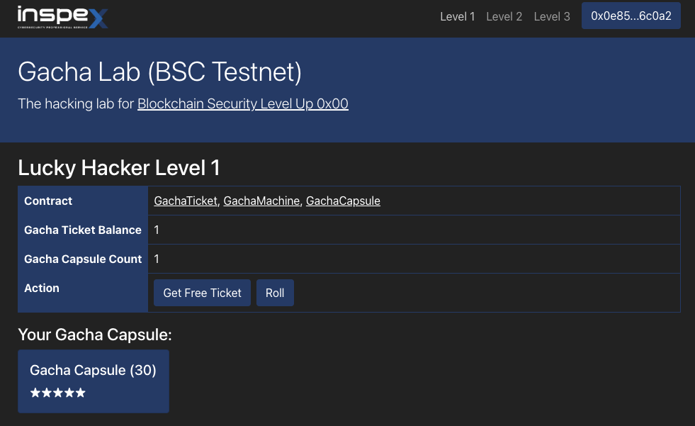

# Lucky Hacker Level 1

### **Vulnerability**
* Weak randomness: Attacker can predict random number thought global variables

```uint256(keccak256(abi.encodePacked(block.timestamp, block.number, msg.sender, gachaCapsule.totalSupply()))) % 100```

block.timestamp, block.number can be predicted, when attacker call execute attack those value will be the same since it happends in the same transaction

### **Attack**
* Create `GachaAttack` contract, which implement attack function
* Inside attack function, implement handling error state, which will revert when this contract does not receive Gacha 5 star
* Run until get a Gacha 5 star and transfer its ownership to ATTACKER

### **Result**
