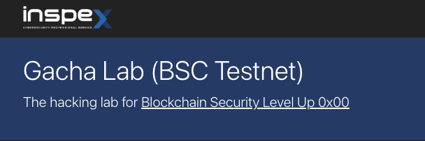

# Gacha Lab

Inspex has implemented a hacking lab named Gacha Lab (https://gachalab.inspex.co/) as examples of vulnerable implementations in order to help security researchers or developers to understand the bad randomness issue for NFT minting mechanism.

